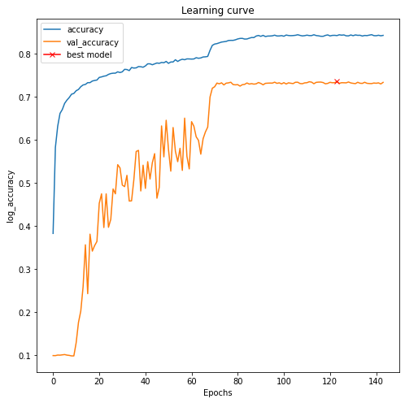
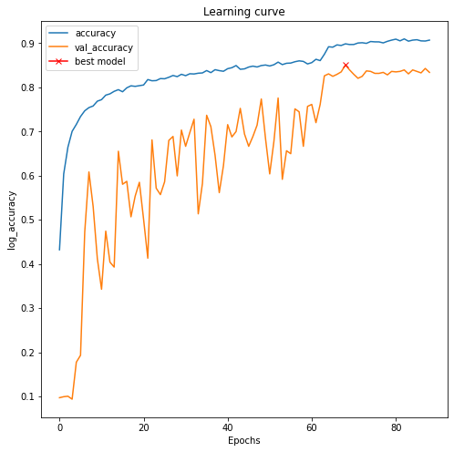

# training-batchnorm-and-only-batchnorm
Training batchnorm and only batchnorm on keras tensorflow

Link to publication: https://arxiv.org/abs/2003.00152

<h2>Files:</h2>

1_batchnorm_only_batchnorm.ipynb - training the ResNet50 on a CIFAR10 dataset without augmentation. Best accuracy - 69%.

2_batchnorm_only_batchnorm.ipynb - training the ResNet50 on a CIFAR10 dataset with augmentation. Best accuracy - 73%. When all weights ResNet50 were trained, on a CIFAR10 dataset best accuracy was 86%.

3_batchnorm_only_batchnorm.ipynb - training the ResNet50 on a Imagenet10 mini dataset with augmentation. Best accuracy - 85%. All weights ResNet50 were trained, on a mini Imagenet10 dataset best accuracy was 95%.

In all experiments, I used the Adam optimizer instead of SGD, with a starting learning rate 0.01 and reducing it to 1e-05, the batch size is 1024 instead of 128 from the original paper. As well as augmentation for experiments 2 and 3.

<b>The purpose of the experiment:</b> to see how much the gamma and beta weights in the batch normalization layers, the total volume of which is less than 1% of the entire network, affect the performance of the network training.

<figure>
  
  <figcaption>Training only gamma and beta weights in batch normalization layers on the ResNet50. CIFAR10 dataset. File: 2_batchnorm_only_batchnorm.ipynb</figcaption>
</figure>

<figure>
  
  <figcaption>Training only gamma and beta weights in batch normalization layers on the ResNet50. Imagenet10 mini dataset. File: 3_batchnorm_only_batchnorm.ipynb</figcaption>
</figure>
<h2>Discussion</h2>

Nobody pays special attention to the layers of Batch normalization, from the experiment we can see what a strong effect they have on the entire neural network. I think that this has no practical application, I assumed that this could speed up the training of the network, if at first I train only the batch normalization layers for several epochs and then the rest of the network, but the experiment on the imagenet dataset showed that this is not so. I also assumed that training the batch normalization layers separately after training the entire network could improve the result, but this could not be confirmed in the experiment with mini imagenet10 dataset. I think I need to experiment with GAN networks. This work is great for understanding how Batch normalization and our entire network in general work.
